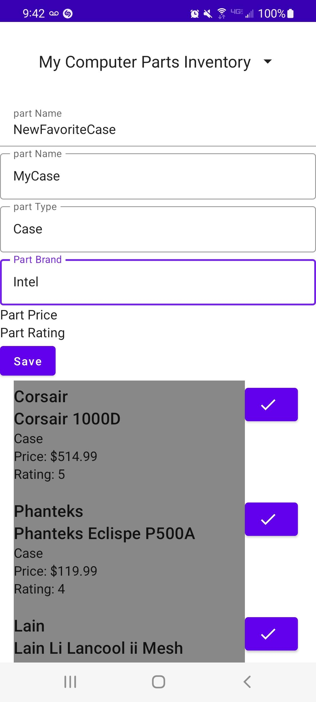
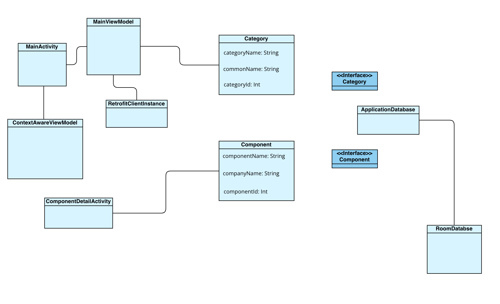

# IT3048CSpringProject
---
# Application Name

## Design Document  

Kadam Patel, Ishida Samuel, Monish Chamlagai, James Devis, Yeati Mishra

## Introduction 
A mobile application that lets you search for computer parts to build your own PC. This app will be a powerful app because users can compare prices or specs of each component saved to the device. This will be useful for building PCs as well as repairing them. Each user of the app can have multiple saved builds of the PCs they own.  

## Storyboard

## Functional Requirements

#### Components of a pc
#### Motherboard
#### Power Supply Unit
#### Power Cables
#### Graphics Card (GPU)
#### Central Processing Unit (CPU)
#### Cooling Fans
#### Heat sink
#### Memory RAM
#### Solid State Drive
#### Hard Drive
#### Water cooling system

## Class Diagram

## Scrum Roles

- DevOps/Product Owner/Scrum Master: James Devis, Kadam Patel
- Frontend Developer: Monish Chamlagai, Ishida Samuel
- Integration Developer: Ishida Samuel, Yeati Mishra

## Weekly Meeting
Every Friday at 4:30pm on Microsoft Teams.
